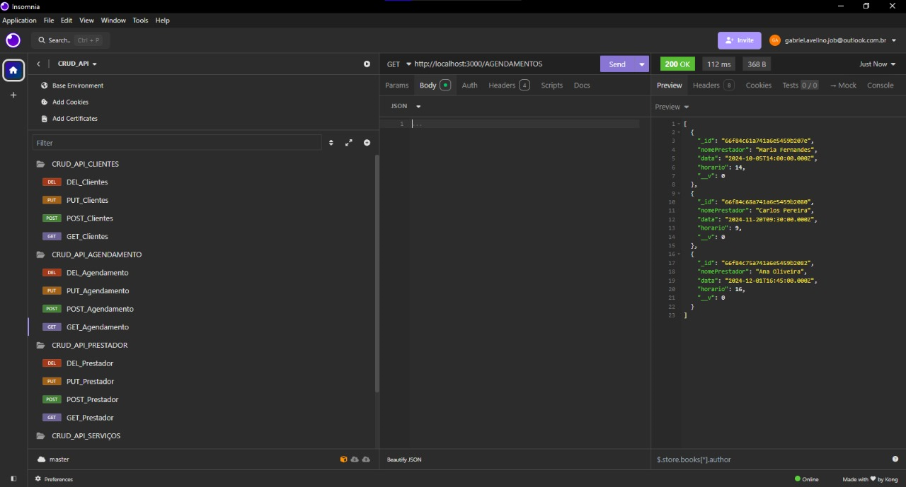

# APIs e Web Services

O objetivo deste projeto é desenvolver uma plataforma de gestão integrada para prestadores de serviços autônomos, que facilite o gerenciamento de agendas e finanças. Com uma interface intuitiva, o software centraliza o controle de compromissos e transações financeiras, permitindo que os usuários evitem a sobrecarga de compromissos e tenham um acompanhamento eficaz de suas receitas e despesas.

## Objetivos da API

A API  densenvolvida será voltada para prestadores de serviços, com uso interno na empresa. Os principais recursos que ela deve fornecer incluem agendamento de compromissos, controle financeiro e geração de relatórios. 

## Arquitetura

 Utilizaremos JavaScript com Node.js e o framework Express. Essa combinação oferece um ambiente leve e escalável para construir APIs, gerenciando a lógica do servidor de forma eficiente. Com o Express, será possível estruturar rotas e middlewares, facilitando a implementação de funcionalidades como agendamento de compromissos e controle financeiro. Para o gerenciamento de dados, empregaremos o MongoDB como banco de dados NoSQL, que permite armazenar informações de maneira flexível e escalável. Usaremos também o Mongoose, uma biblioteca que fornece uma interface elegante para interagir com o MongoDB, facilitando a modelagem de dados e a validação de esquemas.

## Modelagem da Aplicação

As entidades:

* Prestador de Serviços: os usuários da aplicação.
* Clientes: aquele consume os serviços dos Prestadores de serviços do sistema.
* Serviços: atividade prestada pelo Prestador de serviços.
* Agendamentos: marcação de atendimentos no sistema, demonstrando assim, a sua descrição, data e horário.
  
  

## Fluxo de Dados

O fluxo de dados da aplicação adota o modelo cliente-servidor, conforme demonstrado no diagrama a seguir:

## Requisitos Funcionais

| ID    | Descrição do Requisito                                        | Prioridade |
|-------|---------------------------------------------------------------|------------|
| RF-001 | Permitir que o prestador se cadastre no sistema | ALTA       |
| RF-002 | Permitir o gerenciamento de clientes | ALTA |
| RF-003 | Permitir o gerenciamento de serviços | MÉDIA |
| RF-004 | Permitir o gerenciamento dos agendamentos dos prestadores | MÉDIA |
| RF-005 |Permitir gerenciamento das transações financeiras (receitas e despesas) | ALTA |
| RF-006 | Permitir que os usuários possam emitir relatórios | ALTA       |

## Requisitos Não Funcionais

| ID    | Descrição do Requisito                                      | Prioridade |
|-------|-------------------------------------------------------------|------------|
| RNF-001 | Permitir a autenticação dos usuários (login e senha) | ALTA  |
| RNF-002 | Oferecer uma interface intuitiva | MÉDIA |
| RNF-003 | Desenvolver um sistema responsivo para acesso em dispositivos móveis | ALTA |
| RNF-004 | Preparar o sistema para suportar aumento no número de clientes, agendamentos e transações | ALTA |
| RNF-005 | Adequar a aplicação perante as normas de proteção de dados | ALTA |
| RNF-006 | Garantir a segurança dos dados pessoais e financeiros | ALTA |

## Tecnologias Utilizadas

* JavaScript com Node.js e o framework Express utilizados para o desenvolvimento da API;
* Visual Studio Code: IDE utilizada em conjunto com JavaScript.
* Github: plataforma de versionamento;
* Banco de dados: MongoDB

## API Endpoints

Os principais endpoints da API, incluindo as operações disponíveis, os parâmetros esperados e as respostas retornadas.

### Endpoint 1
- Método: GET
- URL: http://localhost:3000/prestador/
- Parâmetros:
- Resposta:
  
HTTP/1.1 200 OK
X-Powered-By: Express
Access-Control-Allow-Origin: *
Content-Type: application/json; charset=utf-8
Content-Length: 720
ETag: W/"2d0-DcPcHEZAWaI3OpvRTXSG/o53f2U"
Date: Sun, 29 Sep 2024 17:36:12 GMT
Connection: keep-alive
keep-alive: timeout=5

[
  {
    "_id": "66f9791b3ee201353402f7dc",
    "nome": "Higor",
    "cnpj": "12",
    "telefone": "31999998888",
    "__v": 0
  },
  {
    "_id": "66f97a49846df65419cbd9e4",
    "nome": "Thalita Farias",
    "cnpj": "12345678910",
    "telefone": "31999998888",
    "__v": 0
  }]

### Endpoint 2
- Método: POST
- URL: http://localhost:3000/prestador/
- Parâmetros:
  
  {
    "nome": "Thalita Teste 2",
    "cnpj": "12345678910",
    "telefone": "31999998888",
    "endereco": "Rua A, Bairro B, Cidade C",
    "password": "123456"
}

- Resposta:
  
HTTP/1.1 201 Created
X-Powered-By: Express
Access-Control-Allow-Origin: *
Content-Type: application/json; charset=utf-8
Content-Length: 172
ETag: W/"ac-kOtJ3OOL6z+zJwvDRTsVg0xkgcM"
Date: Sun, 29 Sep 2024 17:39:34 GMT
Connection: keep-alive
keep-alive: timeout=5

{
  "nome": "Thalita Teste 2",
  "cnpj": "12345678910",
  "telefone": "31999998888",
  "endereco": "Rua A, Bairro B, Cidade C",
  "password": "123456",
  "_id": "66f990d61b01779c3467415b",
  "__v": 0
}

### Endpoint 3
- Método: PUT
- URL: http://localhost:3000/prestador/66f97a49846df65419cbd9e4
- Parâmetros:
  
 {
    "nome": "Thalita Oliveira",
    "cnpj": "000000000000",
    "telefone": "31999999999",
    "endereco": "Rua A, Bairro B, Cidade C",
    "password": "123456"
}

- Resposta:

HTTP/1.1 200 OK
X-Powered-By: Express
Access-Control-Allow-Origin: *
Content-Type: application/json; charset=utf-8
Content-Length: 174
ETag: W/"ae-T6fia17vhBy4+XUSzXIyoOqKzKo"
Date: Sun, 29 Sep 2024 17:47:31 GMT
Connection: keep-alive
keep-alive: timeout=5

{
  "_id": "66f97a49846df65419cbd9e4",
  "nome": "Thalita Oliveira",
  "cnpj": "000000000000",
  "telefone": "31999999999",
  "__v": 0,
  "endereco": "Rua A, Bairro B, Cidade C",
  "password": "123456"
}

### Endpoint 4
- Método: DELETE
- URL: http://localhost:3000/prestador/66f97e2b916c1a3632f224ed
- Parâmetros:
- Resposta:
  
HTTP/1.1 204 No Content
X-Powered-By: Express
Access-Control-Allow-Origin: *
Date: Sun, 29 Sep 2024 17:52:02 GMT
Connection: keep-alive
keep-alive: timeout=5

## Considerações de Segurança

* Autenticação: cada usuário possui um usuário (ID) e senha própria para acessar o sistema.
* Banco de dados - MongoDB: apenas os usuários administradores da aplicação podem alterar o banco de dados.
* Usuários do sistema: apenas o prestador de serviços cadastrados podem realizar o gerenciamento de atividades de um perfil.

## Implantação

[Instruções para implantar a aplicação distribuída em um ambiente de produção.]

1. Defina os requisitos de hardware e software necessários para implantar a aplicação em um ambiente de produção.
2. Escolha uma plataforma de hospedagem adequada, como um provedor de nuvem ou um servidor dedicado.
3. Configure o ambiente de implantação, incluindo a instalação de dependências e configuração de variáveis de ambiente.
4. Faça o deploy da aplicação no ambiente escolhido, seguindo as instruções específicas da plataforma de hospedagem.
5. Realize testes para garantir que a aplicação esteja funcionando corretamente no ambiente de produção.

## Testes

Para garantir a qualidade e o bom funcionamento da API, verificamos se cada função ou método da API funciona corretamente isoladamente, utilizando o Insomnia para a realização dos testes. Com o objetivo de testar se os diferentes módulos da aplicação estão interagindo corretamente junto ao banco de dados (MongoDB).

**Casos de teste**
 * Método GET (Agendamento)
 
 * Método POST (Agendamento)
 (https://github.com/ICEI-PUC-Minas-PMV-SI/pmv-si-2024-2-pe6-t2-g10-gestao-de-agenda-e-financas/blob/main/docs/img/POST_Agendamento.png)
 * Método PUT (Agendamento)
 (https://github.com/ICEI-PUC-Minas-PMV-SI/pmv-si-2024-2-pe6-t2-g10-gestao-de-agenda-e-financas/blob/main/docs/img/PUT_Agendamento.png)
 * Método DELETE (Agendamento)
 (https://github.com/ICEI-PUC-Minas-PMV-SI/pmv-si-2024-2-pe6-t2-g10-gestao-de-agenda-e-financas/blob/main/docs/img/DELETE_Agendamento.png)

  * Método GET (Clientes)
 (https://github.com/ICEI-PUC-Minas-PMV-SI/pmv-si-2024-2-pe6-t2-g10-gestao-de-agenda-e-financas/blob/main/docs/img/GET_Cliente.png)
 * Método POST (Clientes)
 (https://github.com/ICEI-PUC-Minas-PMV-SI/pmv-si-2024-2-pe6-t2-g10-gestao-de-agenda-e-financas/blob/main/docs/img/POST_Cliente.png)
 * Método PUT (Clientes)
 (https://github.com/ICEI-PUC-Minas-PMV-SI/pmv-si-2024-2-pe6-t2-g10-gestao-de-agenda-e-financas/blob/main/docs/img/PUT_Cliente.png)
 * Método DELETE (Clientes)
 (https://github.com/ICEI-PUC-Minas-PMV-SI/pmv-si-2024-2-pe6-t2-g10-gestao-de-agenda-e-financas/blob/main/docs/img/DELETE_Cliente.png)

  * Método GET (Prestador)
 (https://github.com/ICEI-PUC-Minas-PMV-SI/pmv-si-2024-2-pe6-t2-g10-gestao-de-agenda-e-financas/blob/main/docs/img/GET_Prestador.png)
 * Método POST (Prestador)
 (https://github.com/ICEI-PUC-Minas-PMV-SI/pmv-si-2024-2-pe6-t2-g10-gestao-de-agenda-e-financas/blob/main/docs/img/POST_Prestador.png)
 * Método PUT (Prestador)
 (https://github.com/ICEI-PUC-Minas-PMV-SI/pmv-si-2024-2-pe6-t2-g10-gestao-de-agenda-e-financas/blob/main/docs/img/PUT_Prestador.png)
 * Método DELETE (Prestador)
 (https://github.com/ICEI-PUC-Minas-PMV-SI/pmv-si-2024-2-pe6-t2-g10-gestao-de-agenda-e-financas/blob/main/docs/img/DELETE_Prestador.png)

  * Método GET (Serviços)
 (https://github.com/ICEI-PUC-Minas-PMV-SI/pmv-si-2024-2-pe6-t2-g10-gestao-de-agenda-e-financas/blob/main/docs/img/GET_Servicos.png)
 * Método POST (Serviços)
 (https://github.com/ICEI-PUC-Minas-PMV-SI/pmv-si-2024-2-pe6-t2-g10-gestao-de-agenda-e-financas/blob/main/docs/img/POST_Servicos.png)
 * Método PUT (Serviços)
 (https://github.com/ICEI-PUC-Minas-PMV-SI/pmv-si-2024-2-pe6-t2-g10-gestao-de-agenda-e-financas/blob/main/docs/img/PUT_Servicos.png)
 * Método DELETE (Serviços)
 (https://github.com/ICEI-PUC-Minas-PMV-SI/pmv-si-2024-2-pe6-t2-g10-gestao-de-agenda-e-financas/blob/main/docs/img/DELETE_Servicos.png)

# Referências

* Como criar uma API completa com NodeJS e Express | Backend - Projeto Full Stack (https://www.youtube.com/watch?v=Cdu0WJhI-d8);
* Microfundamento: Apis e Web Services;
* Introdução às Web APIs (mdnwebdocs).
